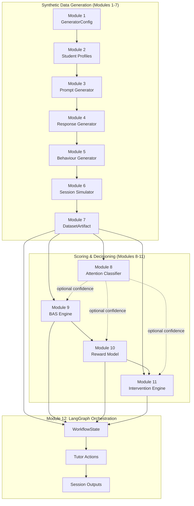
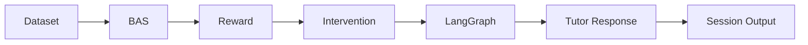
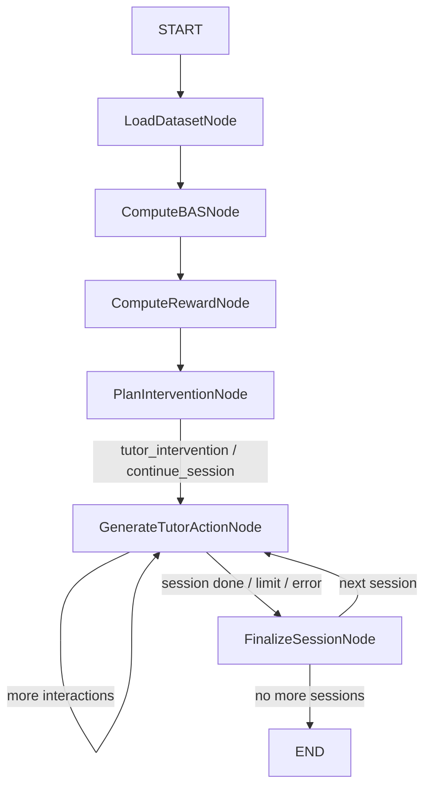

# Behavioral Attention Score (BAS)

### An Explainable, Deterministic Multi-Agent Framework for Adaptive Educational Support

[]()
[]()
[]()
[]()

> **Research software.** This repository generates and processes **synthetic**
> classroom-interaction data. It does not represent, model, or diagnose any
> real individual or clinical condition, and must not be used or interpreted
> as a diagnostic tool.

---

## Overview

This repository implements the full computational pipeline behind a B.Tech
research thesis, *"Behavioral Attention Score (BAS): An Explainable
Multi-Agent Framework for Adaptive Educational Support in ADHD."* It is a
**deterministic, configuration-driven system** that:

1. Simulates synthetic classroom tutoring sessions (students, prompts,
   responses, and behavioural signals),
2. Scores each interaction with a **Behavioural Attention Score (BAS)**,
3. Computes a decomposed **reward signal** from that trajectory,
4. Plans **adaptive tutoring interventions** from the BAS/reward history using
   an explicit, auditable policy engine (not a black-box RL agent), and
5. Orchestrates all of the above as a **LangGraph multi-agent workflow**,
   with checkpointing, memory, and deterministic replay.

Every stage is implementation-honest: nothing here claims to be a trained
reinforcement-learning policy, a multimodal sensing system, or a clinical
tool. It is a synthetic-data generator and a rule/heuristic-driven decision
engine, built so that every claim in the accompanying thesis is backed by
code that actually exists.

## Motivation

Research on ADHD-aware adaptive tutoring is bottlenecked by the absence of
labeled, longitudinal classroom-interaction data — real data is scarce,
sensitive, and slow to collect. This project instead builds a **fully
synthetic, reproducible substitute**: a simulator whose every generative
assumption (attention-state transitions, response quality, behavioural
noise) is an explicit, versioned configuration value, so that:

- Any dataset it produces can be regenerated bit-for-bit from a seed + config,
- The downstream BAS/Reward/Intervention/Orchestration layers can be
  developed and evaluated **before** any real classroom data is available,
- Every design choice (why this attention-classifier feature set, why this
  reward decomposition, why this policy's eligibility rule) is documented
  and ablatable, not tuned by hand against a black box.

## Key Features

- **Deterministic end-to-end pipeline** — a single seed reproduces an
  identical dataset, BAS trajectory, reward trajectory, and intervention
  plan, verified by dedicated determinism tests at every layer.
- **Five behavioural student archetypes**, each a registered strategy class
  (Consistently Focused, Gradually Fatigued, Highly Distractible, Highly
  Impulsive, Recovering Learner) — never an `if`/`elif` chain.
- **An explainable Behavioural Attention Score**, computed as
  `BAS_t = S(E(N(F(x_t))), BAS_{t-1})` — feature extraction, normalization,
  evidence combination, and temporal smoothing as separate, inspectable
  stages, not one opaque weighted sum.
- **A decomposed reward model**, `R_t = R_performance + R_behaviour − R_cost`,
  making ablation studies ("what happens if we remove the behaviour term?")
  a one-line config change.
- **Eight independent, config-driven intervention policies** (Hint, Concept
  Review, Difficulty Reduction, Motivational Prompt, Break Recommendation,
  Encouragement, Question Reframing, No Intervention) — explicitly **not** a
  trained RL policy, so every recommendation has a human-readable reason.
- **A LangGraph orchestration layer** that wires the whole pipeline together
  as a checkpointable, resumable, replayable multi-agent graph — without
  reimplementing a single line of the underlying engines.
- **100,000+ record/decision/interaction stress tests** for every major
  module, alongside a full unit/integration test suite.

## Research Contributions

1. A reproducible, config-driven synthetic classroom-interaction generator
   with explicit statistical distributions per behavioural signal.
2. A mathematically explicit, temporally-smoothed attention-score formula
   with per-feature explanations, rather than an unexplained composite metric.
3. An explicit reward decomposition (performance / behaviour / cost) enabling
   clean ablation studies, instead of one hand-tuned weighted sum.
4. A deterministic, auditable intervention-policy engine as an explainable
   alternative to an opaque RL policy — every decision traces to a named
   policy, its eligibility rule, and its trigger reasons.
5. A demonstration that LangGraph can serve purely as an **orchestration
   shell** around deterministic engines, with the graph itself contributing
   zero domain logic — checkpointing, memory, and replay come from the
   orchestration layer, not from any individual engine.

## Architecture Overview



## Pipeline Overview



Each arrow is a **batch, deterministic function call** — `BASEngine.compute`,
`RewardEngine.compute`, `InterventionPlanner.plan` — never a duplicated
reimplementation. Module 12 (LangGraph) is the only layer that adds control
flow (routing, looping, checkpointing) on top; it computes nothing itself.

## Repository Structure

```
bas-dataset-generator/
├── dataset_generator/
│   ├── config/            # Module 1  — GeneratorConfig, defaults, fingerprinting
│   ├── models/             # Student, Prompt, Response, Behaviour, Session, Dataset schemas
│   ├── distributions/      # Statistical sampling primitives (Normal/Gamma/Beta/Poisson/...)
│   ├── generators/          # Modules 2-6 — profiles, prompts, responses, behaviour, sessions
│   ├── validators/          # Per-stage validation (prompt/response/behaviour/session/dataset)
│   ├── pipeline/            # Module 7  — DatasetArtifact assembly, export, statistics
│   ├── classifier/           # Module 8  — Attention-state classifier (train/predict/calibrate)
│   ├── bas/                 # Module 9  — Behavioural Attention Score engine
│   ├── reward/               # Module 10 — Reward model (performance/behaviour/cost)
│   ├── intervention/          # Module 11 — Adaptive intervention engine
│   ├── orchestration/         # Module 12 — LangGraph multi-agent orchestration
│   └── utils/                # RNG streams, git info, text metrics, heuristic NLP
├── tests/                   # One test module per package, plus stress tests
├── docs/
│   ├── ARCHITECTURE.md      # Per-module deep dive
│   ├── PIPELINE.md          # End-to-end data flow and artifacts
│   ├── ORCHESTRATION.md     # Module 12 in detail
│   ├── API.md               # Public API reference
│   ├── TESTING.md           # Test philosophy and coverage
│   └── DESIGN_DECISIONS.md  # Engineering decisions and rejected alternatives
├── requirements.txt
├── pyproject.toml
└── README.md
```

## Installation

```bash
git clone https://github.com/saminadamn/behavioral-attention-score.git
cd behavioral-attention-score
python -m venv .venv
source .venv/bin/activate        # Windows: .venv\Scripts\activate
pip install -r requirements.txt
```

Requires **Python 3.10+**. Core dependencies: `pydantic>=2.5`, `numpy`,
`pandas`, `scipy`, `scikit-learn`, `joblib`, `langgraph>=1.2`.

## Quick Start

```bash
pytest -q                       # run the full test suite
pytest -q -k "not stress"       # skip the 100k+ stress tests (much faster)
```

## Example Usage

Run the complete pipeline end-to-end through the LangGraph orchestration
layer in a few lines:

```python
from dataset_generator.orchestration import build_graph, compile_graph, new_workflow_state

# Build and compile the orchestration graph (defaults: BASEngine, RewardEngine,
# InterventionPlanner, TutorAgent, SessionAgent all wired with their own defaults)
graph = build_graph(student_count=5, sessions_per_student=2)
compiled = compile_graph(graph)

result = compiled.invoke(new_workflow_state())

print(f"Sessions processed: {len(result['session_outputs'])}")
print(f"Tutor actions generated: {len(result['tutor_actions'])}")
for action in result["tutor_actions"][:3]:
    print(f"  [{action['action_type']}] {action['message']}")
```

Or call each engine directly, without the orchestration layer, exactly as
every module's own test suite does:

```python
from dataset_generator.config import default_config
from dataset_generator.generators import generate_students, generate_sessions
from dataset_generator.pipeline import build_dataset_artifact
from dataset_generator.bas import BASEngine
from dataset_generator.reward import RewardEngine
from dataset_generator.intervention import InterventionPlanner
from dataset_generator.utils import build_rng_streams

config = default_config()
streams = build_rng_streams(config.seed)
students = generate_students(config, streams)[:5]
sessions = generate_sessions(config, students, sessions_per_student=2,
                              rng_streams=build_rng_streams(config.seed))

dataset_artifact = build_dataset_artifact(config, students, sessions)
bas_artifact = BASEngine().compute(dataset_artifact)
reward_artifact = RewardEngine().compute(dataset_artifact, bas_artifact)
intervention_artifact = InterventionPlanner().plan(dataset_artifact, bas_artifact, reward_artifact)

print(intervention_artifact.statistics.intervention_rate)
```

## Configuration

Every generation parameter lives in one typed, validated `GeneratorConfig`
(`dataset_generator/config/schema.py`) — nothing is hardcoded in a
generator, validator, or engine. `default_config()` returns a ready-to-use
instance; every section (student profiles, prompt curriculum, response
generation, behaviour distributions, session simulation, attention-state
transition matrices) is independently overridable. `compute_fingerprint()`
produces a deterministic SHA-256 hash of the whole config, stored in every
downstream artifact's manifest so a dataset's exact provenance is always
recoverable.

The BAS/Reward/Intervention engines each carry their own analogous config
object (`FeatureNormalizationConfig`, `RewardConfig`, `InterventionConfig`),
following the same "everything configurable, nothing hardcoded" convention,
each with its own config fingerprint.

## Generated Artifacts

| Artifact | Produced by | Contents |
|---|---|---|
| `DatasetArtifact` | Module 7 | Records, validation results, statistics, manifest (seed, config fingerprint, git commit) |
| `TrainingArtifact` | Module 8 | Trained classifier, preprocessing pipeline, evaluation metrics, feature importances |
| `BASArtifact` | Module 9 | Per-interaction BAS scores, confidence, per-feature contributions, session summaries |
| `RewardArtifact` | Module 10 | Per-interaction reward (raw + decomposed), confidence, session summaries |
| `InterventionArtifact` | Module 11 | Per-interaction decisions, candidate policies considered, session summaries, statistics |
| `WorkflowState` / snapshot | Module 12 | All of the above plus tutor actions, session outputs, execution history, timing stats |

Every artifact is a frozen Pydantic model, JSON-serializable (`save_*`/`load_*`
functions in each module's `serialization.py`), and carries a schema version
and config fingerprint for reproducibility.

## Module Overview

| # | Module | Package | Role |
|---|---|---|---|
| 1 | Configuration | `config/` | Single source of truth for every generation parameter |
| 2 | Student Profiles | `generators/student_profile_generator.py` | Five behavioural archetypes |
| 3 | Prompt Generator | `generators/prompt_generator.py` | Curriculum-driven prompt templates |
| 4 | Response Generator | `generators/response_generator.py` | Attention-state-conditioned synthetic responses |
| 5 | Behaviour Generator | `generators/behaviour_generator.py` | Latency/fatigue/engagement signal sampling |
| 6 | Session Simulator | `generators/session_simulator.py`, `transition_engine.py` | Temporal attention-state transitions across a session |
| 7 | Dataset Assembly | `pipeline/dataset_artifact.py` | Validation, statistics, manifest → `DatasetArtifact` |
| 8 | Attention Classifier | `classifier/` | Supervised attention-state prediction (LogReg/RF/GBM), calibrated |
| 9 | BAS Engine | `bas/` | `BAS_t = S(E(N(F(x_t))), BAS_{t-1})` |
| 10 | Reward Model | `reward/` | `R_t = R_performance + R_behaviour − R_cost` |
| 11 | Intervention Engine | `intervention/` | Deterministic need-detection + 8 policies + cooldown |
| 12 | Orchestration | `orchestration/` | LangGraph `StateGraph` wiring Modules 7/9/10/11 |

See [docs/ARCHITECTURE.md](docs/ARCHITECTURE.md) for the full per-module deep
dive (purpose, inputs/outputs, internal components, design decisions,
tradeoffs, time complexity, extensibility).

## LangGraph Workflow

Module 12 orchestrates Modules 7/9/10/11 as a two-phase LangGraph
`StateGraph`: a **batch phase** (`LoadDataset → ComputeBAS → ComputeReward →
PlanIntervention`, each one call into the corresponding engine over the whole
dataset) followed by a **per-interaction walk** (`GenerateTutorAction ⇄
FinalizeSession`, looping session-by-session with real conditional routing
for intervention-needed/continue-session, early termination, interaction
limits, and error handling).



See [docs/ORCHESTRATION.md](docs/ORCHESTRATION.md) for `WorkflowState`,
agents, nodes, routing, memory, checkpointing, and failure recovery in full
detail.

## Determinism

Every layer is deterministic given a seed: the same `GeneratorConfig.seed`
produces bit-identical `DatasetArtifact`/`BASArtifact`/`RewardArtifact`/
`InterventionArtifact` records, and the same `WorkflowState` inputs produce
identical `tutor_actions`/`session_outputs` (excluding wall-clock
`generation_timestamp` fields, which are metadata, not data). RNG draws are
isolated per concern via independent `numpy` `Generator`/`SeedSequence`
streams (`RNGStreams`), so, e.g., changing the noise model doesn't perturb
student-profile sampling.

## Checkpointing

Module 12 compiles the graph with `interrupt_after` set on every node plus a
LangGraph checkpointer, so execution genuinely pauses and persists state at
every node boundary — this comes from LangGraph's own mechanism, not a
parallel implementation. `checkpoint.py` provides `run_to_completion`,
`resume_execution`, and `recover_failed_session` (clearing a session's
recorded errors and replaying on a fresh thread) on top of it.

## Serialization

Every artifact round-trips through plain JSON (`save_*_artifact`/
`load_*_artifact` in each module), carrying its schema version and config
fingerprint. `orchestration/serialization.py` additionally snapshots a whole
`WorkflowState` (all four artifacts plus execution history/timing/errors) as
one portable file, distinct from the checkpointer's in-thread persistence.

## Reports

Every module ships a `report.py` producing both a Markdown report (for a
research log) and a JSON report (for programmatic consumption) — decision
tables, policy/action-type distributions, session summaries, statistics, and
(for Module 12) node/agent timings and failure summaries. No module
generates plots; all "trend" data is descriptive series, not rendered charts.

## Testing

One test module per package (`tests/test_*.py`), covering unit behaviour,
end-to-end integration against the real upstream engines (never mocked),
determinism, edge cases, and a 100,000+-scale stress test per module using a
shared technique: replicate a small, genuinely-simulated batch with
re-suffixed IDs rather than re-running full simulation 100,000+ times. See
[docs/TESTING.md](docs/TESTING.md) for the full philosophy and coverage
breakdown.

```bash
pytest -q                                        # everything
pytest -q -k "not stress"                        # fast path, skips 100k+ tests
pytest tests/test_orchestration.py -v            # Module 12 only
```

## Benchmarks

| Stress test | Scale | Module |
|---|---|---|
| Dataset generation | 100,000+ records | Module 7 |
| Classifier training/prediction | 100,000+ records | Module 8 |
| BAS computation | 100,000+ records | Module 9 |
| Reward computation | 100,000+ records | Module 10 |
| Intervention planning | 100,000+ decisions | Module 11 |
| Orchestration graph execution | 100,000+ interactions, one compiled graph | Module 12 |

Exact current runtimes are recorded in `docs/TESTING.md`.

## Roadmap

- [ ] Public dataset release (exported CSV/JSONL/Parquet + manifest) for the
      thesis's evaluation section.
- [ ] Optional persistent checkpointer (e.g. SQLite-backed) for
      cross-process orchestration resume, beyond the current in-process
      `MemorySaver`.
- [ ] A future Module 13: a lightweight dashboard over `InterventionArtifact`/
      `WorkflowState` reports (explicitly out of scope for this repository
      today).
- [ ] Expanded ablation-study tooling built on the existing
      `with_category_disabled`/`with_policy_disabled` config helpers.

## Citation

If you use this codebase in academic work, please cite:

```bibtex
@misc{bas-thesis,
  title        = {Behavioral Attention Score (BAS): An Explainable Multi-Agent
                   Framework for Adaptive Educational Support in ADHD},
  author       = {<author name>},
  year         = {<year>},
  howpublished = {B.Tech thesis},
  institution  = {<institution>},
  note         = {Code: \url{https://github.com/saminadamn/behavioral-attention-score}}
}
```

## License

License: **TBD** — to be finalized before public release.

## Acknowledgements

Built as part of a B.Tech thesis project. Orchestration layer built on
[LangGraph](https://github.com/langchain-ai/langgraph). Statistical modeling
via `numpy`/`scipy`; classification via `scikit-learn`; data modeling via
`pydantic`.
