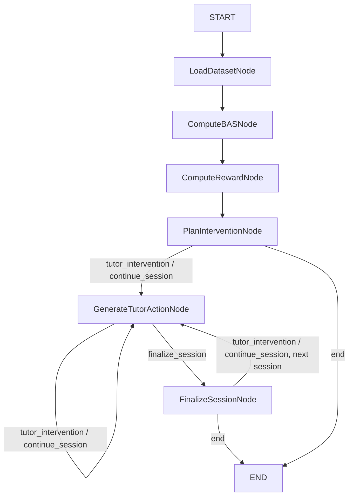

# Module 12: Orchestration, In Detail

Module 12 (`dataset_generator/orchestration/`) coordinates Modules 7, 9, 10,
and 11 as a deterministic [LangGraph](https://github.com/langchain-ai/langgraph)
`StateGraph`. It contributes **zero domain logic** — every number in a
`WorkflowState` comes from `BASEngine`, `RewardEngine`, or
`InterventionPlanner`, called exactly as their own test suites call them.
This document covers `WorkflowState`, agents, nodes, routing, memory,
checkpointing, serialization, reporting, the execution lifecycle,
deterministic replay, and failure recovery.

## `WorkflowState`

`WorkflowState` (`state.py`) is a `TypedDict`, not a frozen Pydantic model
like every other artifact in the project — deliberately, because LangGraph
nodes return *partial* state updates that the graph merges on each step, a
different mutation model than the rest of the codebase's frozen-Pydantic
convention. Every artifact field inside it (`DatasetArtifact`, `BASArtifact`,
`RewardArtifact`, `InterventionArtifact`) is the real, untouched Pydantic
type from Modules 7/9/10/11 — only the outer container adapts to LangGraph's
shape.

Two kinds of fields:

- **Batch artifacts** — `dataset_artifact`, `bas_artifact`, `reward_artifact`,
  `intervention_artifact` — set once by the batch phase, read-only after.
- **Iteration/accumulator fields** — `session_ids`, `current_session_index`,
  `current_session_id`, `current_student_id`, `current_interaction_index`,
  `max_interactions_per_session` (cursors, plain overwrite semantics), and
  `tutor_actions`, `session_outputs`, `errors`, `execution_history`,
  `timing_stats` (accumulators, using a custom `Annotated[list, _append]`
  reducer so repeated node calls append rather than clobber each other).

`ExecutionEvent`/`WorkflowError` carry an `interaction_index` field — the
0-based walk cursor at the time the node ran — deliberately named
differently from the domain-level, 1-based `interaction_number` used on
`TutorAction`/`InterventionDecision`, so the two scales are never confused.

## Agents

Each agent in `agents.py` wraps exactly one existing engine's public entry
point — no logic is reimplemented:

| Agent | Wraps | Notes |
|---|---|---|
| `ObserverAgent` | `generate_students`/`generate_sessions`/`build_dataset_artifact` | `.generate()` simulates fresh; `.observe()` passes through an injected `DatasetArtifact` unchanged |
| `BASAgent` | `BASEngine.compute` | Pure pass-through, dependency-injectable engine instance |
| `RewardAgent` | `RewardEngine.compute` | Same pattern |
| `InterventionAgent` | `InterventionPlanner.plan` | Same pattern |
| `TutorAgent` | — | The one new translation step: formats `InterventionDecision.chosen_policy`/`chosen_reason` into a `TutorAction`; never calls `.eligible()`/`.score()`/any policy method again |
| `SessionAgent` | — | Pure aggregation of a `SessionWalkResult` into a `SessionOutput` |

`prompts.py`'s `POLICY_ACTION_TYPES` maps each of Module 11's 8 registered
policy names to a human-readable action-type label (e.g.
`ConceptReviewPolicy → "Concept Review"`) — a static lookup table, not an
LLM call; a test asserts this table always covers every policy
`InterventionPolicyFactory` currently registers.

## Nodes

Six nodes (`nodes.py`), each a factory function (`make_load_dataset_node`,
etc.) returning a `(WorkflowState) -> dict` closure — dependency injection
happens at the factory call, not inside the closure:

| Node | Phase | Wraps |
|---|---|---|
| `LoadDatasetNode` | Batch | `ObserverAgent`; also initializes cursors |
| `ComputeBASNode` | Batch | `BASAgent` |
| `ComputeRewardNode` | Batch | `RewardAgent` |
| `PlanInterventionNode` | Batch | `InterventionAgent` |
| `GenerateTutorActionNode` | Per-interaction | `TutorAgent`; advances the interaction cursor |
| `FinalizeSessionNode` | Per-interaction | `SessionAgent`; advances the session cursor |

A shared `_traced_node` decorator wraps every node uniformly: it times the
call, appends one `timing_stats` entry and one `execution_history` entry,
and catches any exception into one `errors` entry instead of letting it
crash the graph — so a router can inspect `errors` and decide whether to
halt gracefully.

`ordered_decisions_for_session`, `session_has_error`, and
`max_interactions_reached` are small shared helpers used by both nodes and
the router (see below) so the "does this session have an error" / "has the
limit been hit" checks are computed in exactly one place.

## Routing / Conditional Edges

One router function, `route_next_step` (`graph.py`), is reused at three
wiring points — after `plan_intervention`, after `generate_tutor_action`,
and after `finalize_session` — because all three ask the same question:
*given the current cursor, what's next?*

`route_next_step`'s four possible answers:

1. **`"end"`** — no sessions at all (empty dataset).
2. **`"finalize_session"`** — the current session has a recorded error, has
   exhausted its interactions, or has hit `max_interactions_per_session`.
3. **`"tutor_intervention"` / `"continue_session"`** — there's another
   interaction to process; both route to `generate_tutor_action` (which
   produces the correct action either way — a real intervention or an
   explicit "No Intervention" action), but are distinct, labeled LangGraph
   edges matching a fork/merge shape. The distinction stays observable
   downstream via `TutorAction.source_policy`.

**Operational note on very large batches:** the per-interaction walk takes
one LangGraph "step" per interaction. LangGraph's Pregel scheduler caps
total steps per run via `recursion_limit` (a safety guard against infinite
loops, unrelated to Python's call-stack recursion) — its default is far
below a 100,000+-interaction dataset's step count. Pass an explicit,
sufficiently high limit for large batches:
`compiled.invoke(state, config={"recursion_limit": N})`.

## Memory

`WorkflowMemory` (`memory.py`) is a thin, **stateless view** over an
existing `WorkflowState` — not a new store. It holds nothing beyond a
reference to the state it was built from; every query method filters/sorts
data Modules 9–11 and this module's own nodes already computed:
`previous_interventions`, `previous_tutor_actions`, `session_history`,
`reward_history`, `bas_history` (each optionally filtered by `session_id`/
`student_id`). Because there's no independent mutable store, replay is
deterministic for free — the same state always yields the same query
results. No vector database, no LLM.

## Checkpointing

`checkpoint.py` builds directly on LangGraph's own checkpointer mechanism.
`compile_checkpointed_graph` compiles with `interrupt_after` set on **every**
node name, so LangGraph persists state and genuinely pauses execution at
every node boundary — "checkpoint every node" is a consequence of that
compile-time setting, not custom code.

`default_checkpointer()` wraps `MemorySaver` with
`JsonPlusSerializer(allowed_msgpack_modules=True)` — a real fix, not just a
formality: without it, LangGraph's default serializer silently **drops**
fields it doesn't recognize (our Pydantic artifact types) on checkpoint
reload rather than erroring, which is worse than the informational log line
this setting produces. `True` is safe specifically because checkpoint state
here is exclusively this project's own trusted, internally-defined types —
never externally-supplied data.

Resuming falls directly out of `route_next_step` being a pure function of
`WorkflowState` rather than "which step we're on": once a checkpointed state
is loaded, calling `.invoke()` again picks the routing back up exactly where
it left off. No separate resume code path is needed beyond restoring the
state and invoking again — `run_to_completion`/`resume_execution` are both
built on one shared `_drain` helper that loops `.invoke(None, config)` until
`get_state(config).next` is empty.

### Failure Recovery

`recover_failed_session(state)` returns a **new** state with the current
session's recorded errors cleared — a deliberate, explicit operation, not
automatic. The caller is expected to replay the result on a **fresh**
`thread_id`: a fresh thread has no prior checkpoint to merge against, so the
`errors` accumulator's append-reducer won't re-append what was just cleared.
This lets `route_next_step` retry the session's current interaction instead
of routing straight to `finalize_session`.

## Serialization

`orchestration/serialization.py` is distinct from the checkpointer above:
the checkpointer persists in-thread state for LangGraph's own pause/resume
machinery; this module saves/loads a whole `WorkflowState` as **one portable
JSON file** — for archival, cross-process transfer, or handing a finished
run's state to another tool. `config_fingerprints(state)` surfaces every
wrapped artifact's own already-computed fingerprint in one place.

**Caveat:** a loaded `WorkflowState` is a plain value, not a resumable graph
position. Passing it to `compiled.invoke(loaded_state)` on a
non-checkpointed graph restarts from `START` (`LoadDatasetNode` always
resets cursors as the entry point), which would re-walk Phase 2 and double
the accumulator fields on top of what was loaded. To resume mid-run, use the
checkpointing flow above instead.

## Reporting

`report.py` produces both a Markdown report (for a research log) and a JSON
report (for programmatic consumption): execution summary, decision counts,
intervention frequencies (from this run's own `tutor_actions` — what was
actually walked, not the full batch-computed dataset), node/agent timings
(the same aggregation presented once, since every node here wraps exactly
one agent call), and a failure summary grouped by node and by session. No
plots.

## Execution Lifecycle

1. **Batch phase** — `LoadDataset → ComputeBAS → ComputeReward →
   PlanIntervention`, each a single call over the whole dataset.
2. **Per-interaction walk** — for the current session's current interaction:
   `route_next_step` decides `tutor_intervention`/`continue_session` →
   `GenerateTutorActionNode` produces one `TutorAction`, advances the
   cursor → loop.
3. **Session finalization** — once a session's interactions are exhausted,
   the limit is hit, or an error is recorded: `FinalizeSessionNode`
   aggregates what was actually walked into one `SessionOutput`, advances
   to the next session (or `END` if none remain).

## Deterministic Replay

Given the same input `DatasetArtifact` (itself deterministic from a seed +
config, per Modules 1–7), the same `WorkflowState` run produces bit-identical
`tutor_actions`/`session_outputs`/`bas_artifact`/`reward_artifact`/
`intervention_artifact` — verified directly by
`test_full_run_deterministic` and `test_planner_deterministic`-style tests,
excluding wall-clock `generation_timestamp` fields (metadata, not data).
