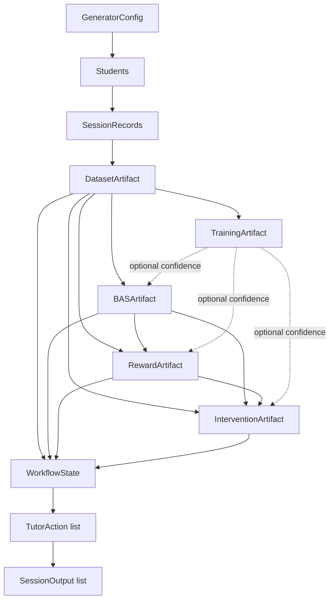

# Pipeline: End-to-End Data Flow

This document explains the complete data flow through the system, from a
`GeneratorConfig` to a fully orchestrated `WorkflowState`, and every artifact
produced along the way. For per-module internals (classes, algorithms,
complexity), see [ARCHITECTURE.md](ARCHITECTURE.md). For Module 12 in
isolation, see [ORCHESTRATION.md](ORCHESTRATION.md).



## Stage 1: Dataset (Modules 1–7)

**Entry point:**

```python
config = default_config()                                          # Module 1
streams = build_rng_streams(config.seed)                            # utils/rng.py
students = generate_students(config, streams)                       # Module 2
sessions = generate_sessions(config, students, sessions_per_student=2,
                              rng_streams=build_rng_streams(config.seed))  # Modules 3-6
dataset_artifact = build_dataset_artifact(config, students, sessions)     # Module 7
```

Internally, `generate_sessions` drives, for every student and every session,
one `SessionSimulator.simulate_session()` call, which in turn drives Modules
3–6 once per interaction: a `Prompt` (Module 3), a `Response` conditioned on
the student's current attention state (Module 4), a `BehaviourRecord` derived
from that response (Module 5), and a Markov transition to the next attention
state (Module 6's `TransitionEngine`). `build_dataset_artifact` (Module 7)
then flattens every `SessionRecord` into one `DatasetRecord` per interaction,
validates the whole set, computes distributional statistics, and stamps a
manifest.

**Produced artifact — `DatasetArtifact`:**

| Field | Contents |
|---|---|
| `records` | One `DatasetRecord` per interaction — ~60 denormalized fields spanning student/prompt/response/behaviour/session-aggregate data |
| `statistics` | `DatasetStatistics` — per-feature distributions, class/profile/subject/difficulty balance, correlation matrix |
| `validation` | `DatasetValidationReport` — missing values, duplicates, range violations, impossible transitions, orphan IDs, schema consistency |
| `metadata` | `DatasetMetadata` — student/session/record counts, subjects/profiles covered |
| `manifest` | `DatasetManifest` — dataset/schema/generator version, seed, config fingerprint, git commit, timestamp |
| `exports` | Populated only after `export_dataset_artifact()` writes CSV/Parquet/JSONL + metadata/manifest JSON |

## Stage 2: Attention Classifier (Module 8, optional)

**Entry point:**

```python
trainer = AttentionClassifierTrainer()
training_artifact = trainer.train(dataset_artifact, TrainingConfig(model_name="random_forest"))
predictor = AttentionClassifierPredictor(training_artifact)
```

Trains a supervised classifier (logistic regression / random forest /
gradient boosting, optionally XGBoost/LightGBM if installed) to predict
`attention_state` from the dataset's own feature columns — used **only** as
an optional confidence signal for BAS/Reward/Intervention (each accepts an
`AttentionClassifierPredictor | None`); never a required dependency, and
never re-derives the attention-state labels the dataset itself already
carries as ground truth.

**Produced artifact — `TrainingArtifact`:** the fitted model + preprocessing
pipeline, classification metrics, optional calibration result, optional
feature-importance report, and training metadata (including the exact
`feature_names` list every future inference call reindexes against).

## Stage 3: BAS (Module 9)

**Entry point:**

```python
bas_artifact = BASEngine().compute(dataset_artifact)
```

For every interaction, extracts a feature vector from `DatasetRecord` fields
(never resampling behaviour), normalizes each feature into [0,1], combines
normalized evidence into a raw score, and applies temporal smoothing against
the previous interaction's BAS within the same session:

```
BAS_t = S( E( N( F(x_t) ) ), BAS_{t-1} )
```

where `F` extracts features, `N` normalizes, `E` combines evidence into a raw
score, and `S` smooths against the prior BAS. `BASEngine.compute` never
mutates or reruns generation — it reads `DatasetArtifact.records` exactly as
produced by Module 7.

**Produced artifact — `BASArtifact`:** one `BASRecord` per interaction
(`raw_score`, `score`, `confidence`, per-feature `contributions`), per-session
summaries, and dataset-wide statistics.

## Stage 4: Reward (Module 10)

**Entry point:**

```python
reward_artifact = RewardEngine().compute(dataset_artifact, bas_artifact)
```

Consumes `DatasetArtifact` + `BASArtifact` (never recomputing BAS), extracts
reward-relevant signals per interaction, aggregates them into a raw reward
with an explicit three-way decomposition, then applies temporal credit
assignment across the session:

```
R_t = R_performance + R_behaviour − R_cost
```

The decomposition is enforced as an **exact identity** (`raw_reward ==
performance + behaviour − cost`, verified by a dedicated invariant test) via
a two-pass aggregation that renormalizes each signal's weight over what was
actually available, then reuses that same renormalized weight for both the
raw sum and the stored per-signal contribution.

**Produced artifact — `RewardArtifact`:** one `RewardRecord` per interaction
(`raw_reward`, credited `reward`, `performance_reward`, `behaviour_reward`,
`cost_reward`, per-signal `contributions`, `confidence`), per-session
summaries, and dataset-wide statistics including per-category averages.

## Stage 5: Intervention (Module 11)

**Entry point:**

```python
intervention_artifact = InterventionPlanner().plan(dataset_artifact, bas_artifact, reward_artifact)
```

Consumes all three prior artifacts (never recomputing any of them). For each
interaction: extracts an `InterventionObservation` (current/previous
BAS/reward, trends, fatigue, engagement, consecutive-decline count, etc.),
runs `InterventionDetector` to produce a `need_score` + trigger reasons +
severity, evaluates all 8 registered policies' eligibility and scores them,
applies session-scoped cooldown/limit filtering, and estimates a confidence
for the resulting decision. This is an **explicit rule/heuristic engine**,
not a trained RL policy — every decision traces to a named policy class and
a human-readable reason string.

**Produced artifact — `InterventionArtifact`:** one `InterventionDecision`
per interaction (need score, trigger reasons, severity, chosen policy +
reason, all evaluated candidates, cooldown-suppression flag, confidence),
per-session summaries (intervention counts, policy frequencies, cumulative
estimated gains), and dataset-wide statistics (intervention rate, policy
distribution).

## Stage 6: LangGraph Orchestration (Module 12)

**Entry point:**

```python
graph = build_graph(student_count=5, sessions_per_student=2)
compiled = compile_graph(graph)
result = compiled.invoke(new_workflow_state())
```

Wires Stages 1, 3, 4, and 5 above (Modules 7/9/10/11) into a single
deterministic `LangGraph` `StateGraph`. A **batch phase** computes the four
artifacts once over the whole dataset (identical calls to the entry points
shown above, just wrapped in nodes); a **per-interaction walk** then produces
one `TutorAction` per interaction — a pure translation of the
already-computed `InterventionDecision.chosen_policy`/`chosen_reason`, never
a re-score — and aggregates each session's walked interactions into a
`SessionOutput` once the session is exhausted, hits an interaction limit,
or errors out.

**Produced value — `WorkflowState`:** the four artifacts above, plus
`tutor_actions` (one per walked interaction), `session_outputs` (one per
finalized session), and cross-cutting `execution_metadata`/`errors`/
`execution_history`/`timing_stats`. See
[ORCHESTRATION.md](ORCHESTRATION.md) for the full node/routing/memory/
checkpointing story.

## Every Artifact, at a Glance

| Artifact | Module | Serialization | Report |
|---|---|---|---|
| `DatasetArtifact` | 7 | CSV/Parquet/JSONL + metadata/manifest JSON (`pipeline/dataset_export.py`) | `pipeline/dataset_report.py` |
| `TrainingArtifact` | 8 | joblib (model/preprocessor) + JSON (metrics/metadata) (`classifier/serialization.py`) | n/a (metrics are the report) |
| `BASArtifact` | 9 | Plain JSON (`bas/serialization.py`) | `bas/report.py` |
| `RewardArtifact` | 10 | Plain JSON (`reward/serialization.py`) | `reward/report.py` |
| `InterventionArtifact` | 11 | Plain JSON (`intervention/serialization.py`) | `intervention/report.py` |
| `WorkflowState` snapshot | 12 | Plain JSON, all four artifacts + run history (`orchestration/serialization.py`) | `orchestration/report.py` |

Every artifact is a frozen Pydantic model with a `schema_version` and (except
raw `DatasetMetadata`/`WorkflowState`'s own passthrough fields) a
`config_fingerprint`, so any artifact can be traced back to the exact config
that produced it.
